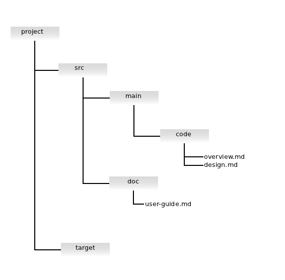

# Overview

[sbt-lwm][] (**_L_**ight **_W_**eight **_M_**arkup) is an [SBT][] 0.11.x
plugin that converts lightweight markup documents to HTML. It currently
supports [Textile][] and [Markdown][].

[sbt-lwm][] uses the [MarkWrap][] library to convert the markup to HTML,
so it supports converting:

* [Markdown][], via the [PegDown][] parser.
* [Textile][], via the [FuseSource WikiText fork][] of then Eclipse
  [Mylyn][] *wikitext* parser API.
* Plain text, wrapped in `<pre>` and `</pre>` tags and surrounded by
  HTML goodness.

# Notes

Versions of this plugin _prior_ to 0.3 _only_ work with SBT 0.10.x. Versions
of this plugin from 0.3 on only work with SBT 0.11.1 and better.

If you're using SBT 0.7, there's an older version (with fewer features and a
different variable syntax) [here](http://software.clapper.org/sbt-plugins/lwm.html).

# Using the Plugin

## Getting the Plugin

First, within your SBT project, create `project/plugins.sbt` (if it
doesn't already exist) and add the following:

    addSbtPlugin("org.clapper" % "sbt-lwm" % "0.3.2")

    resolvers += Resolver.url(
      "sbt-plugin-releases",
      new URL("http://scalasbt.artifactoryonline.com/scalasbt/sbt-plugin-releases/")
    )(Resolver.ivyStylePatterns)

## Using in a `build.sbt` file

In your main project `build.sbt` file, add:

    seq(LWM.settings: _*)

Now the plugin and its settings are available to your SBT builds. Within
`build.sbt`, the pattern for accessing settings is 

    LWM.settingName in LWM.Config <<= ...

or

    settingName in LWM.Config <<= ...

depending on whether the setting is a common SBT one (such as `sources`) or
an LWM-specific one (such as `LWM.targetDirectory`).

For instance:

    sources in LWM.Config <++= baseDirectory map { d =>
      (d / "src" * "*.txt").get ++
      (d / "src" * "*.md").get ++
      (d / "src" * "*.textile").get
    }

    LWM.targetDirectory in LWM.Config << baseDirectory(_ / "target")

    LWM.cssFile in LWM.Config <<= baseDirectory(d => Some(d / "src" / "style.css" ))

You can find the list of settings and tasks below.

## Using in a `Build.scala` file

The pattern for accessing the settings within a full (`Build.scala`) definition
is a little more complicated. For complete details, see the section entitled
*Usage example* in the SBT wiki's [Plugins page][]. Here's an LWM-specific
example:

    import sbt._
    import Keys._
    import org.clapper.sbt.lwm.LWM._

    object MyBuild extends Build {
      override lazy val projects = Seq(root)
      lazy val root = Project(
        "root", file(".")
      ).settings (LWM.settings : _*).settings(
        sources in LWM.Config <++= baseDirectory map { d =>
          (d / "src" * "*.txt").get ++
          (d / "src" * "*.md").get ++
          (d / "src" * "*.textile").get
        }
        LWM.targetDirectory in LWM.Config << baseDirectory(_ / "target")
        LWM.cssFile in LWM.Config <<= baseDirectory(d => Some(d / "src" / "style.css" ))
      )
    }

[Plugins page]: https://github.com/harrah/xsbt/wiki/Plugins

# Settings and Tasks

The plugin provides the following new settings and tasks. From here on out,
the documentation assumes you'll be using `build.sbt`. If you're using a
full `Build.scala`, adapt accordingly, using the previous section as a guide.

**Note**: sbt-lwm uses predefined SBT settings, where possible (e.g.,
`sources`). Where sbt-lwm defines its own settings, *those*  settings are in an
`LWM` namespace, to avoid import clashes with identically named settings from
other plugins. The pattern for accessing settings in this plugin is:

    LWM.settingName in LWM.Config <<= ...

Task access is similar.

## Settings

---

**`sources`**

---

The lightweight markup files to be processed. [sbt-lwm][] uses a file's
extension to recognize what kind of lightweight markup the file contains.
The supported extensions are:

* `.md`, `.markdown`: Markdown
* `.textile`: Textile
* `.txt`, `.text,` `.cfg`, `.conf`, `.properties`: Plain text, wrapped in
  a `<pre>` block.

For instance, suppose you want to process all Markdown files within your
"src" tree. You might set `sources` like this:

    sources in LWM.Config <++= baseDirectory map (d => (d / "src" ** "*.md").get)

If you also want to apply the edits to all files ending in ".markdown"
(perhaps because you're not consistent in your extensions), use either:

    sources in LWM.Confi <++= baseDirectory map (d => (d / "src" ** "*.md").get)

    sources in LWM.Config <++= baseDirectory map (d => (d / "src" ** "*.markdown").get)
    
or, more succinctly:

    sources in LWM.Config <++= baseDirectory { dir =>
      (dir / "src" ** "*.md").get ++
      (dir / "src" ** "*.markdown").get
    }

### Front Matter

Each source file can optionally start with *front matter*, metadata about
the document. The front matter must be separated from the rest of the
document by a single line like this:

    %%%
    
Front matter consists of one or more *item: value* pairs. Currently, the
only supported item is *title*. To set an individual title for a document,
specify the title in the front matter, like so:

    title: A very cool user's guide
    %%%

    # My User's Guide

If the *title* element is omitted, or if the front-matter is missing, then
the resulting `<title>` HTML element will be empty.

---

**`cssFile`**

---

A [cascading style sheet][] (CSS) file to include, inline, in the `<head>`
section of the HTML document(s). This setting is a Scala `Option` pointing
to a file. By default, no CSS file is included in the generated HTML.

Example:

    LWM.cssFile in LWM.Config <<= baseDirectory(d => Some(d / "src" / "style.css" ))

---

**`targetDirectory`**

---

The directory to which to write the HTML versions of the source files.
For example:

    LWM.targetDirectory in LWM.Config <<= baseDirectory(_ / "target")

See also `flatten`, below.

---

**`flatten`**

---

If `flatten` is `true`, then the processed HTML files will all be placed
directly in `targetDirectory`; if there are name clashes, then some files
will be overwritten. If `flatten` is `false`, then the partial path to each
source file is preserved in the target directory.

An example will help clarify. Consider the following file tree:
 

Let's assume you're processing all the files ending in ".md", into the *target*
directory.

    sources in LWM.Config <++= baseDirectory(d => (d / "src" ** "*.md").get)

    LWM.targetDirectory in LWM.Config <<= baseDirectory(_ / "target")
    
If you also set:

    LWM.flatten in LWM.Config := true

the edit operation will put all the HTML versions of all three files
directly in the *target* directory.

If, instead, you set:

    LWM.flatten in LWM.Config := false

you'll end up with the following edited versions:

* _target/src/main/code/overview.html_
* _target/src/main/code/design.html_
* _target/src/doc/user-guide.html_

---

**`encoding`**

---

The encoding of the source file and, hence, the resulting HTML. Defaults
to "UTF-8".

## Tasks

*sbt-lwm* provides two new SBT tasks.

* `lwm:translate` translates the files specified by `sources` to HTML.

* `lwm:clean` deletes all generated HTML files. `lwm:clean`
  is also automatically linked into the main SBT `clean` task.

# Change log

The change log for all releases is [here][changelog].

# Author

Brian M. Clapper, [bmc@clapper.org][]

# Copyright and License

This software is copyright &copy; 2011 Brian M. Clapper and is
released under a [BSD License][].

# Patches

I gladly accept patches from their original authors. Feel free to email
patches to me or to fork the [GitHub repository][] and send me a pull
request. Along with any patch you send:

* Please state that the patch is your original work.
* Please indicate that you license the work to the Grizzled-Scala project
  under a [BSD License][].

[BSD License]: license.html
[sbt-lwm web site]: http://software.clapper.org/sbt-lwm/
[sbt-lwm]: http://software.clapper.org/sbt-lwm/
[Markdown]: http://daringfireball.net/projects/markdown/
[MarkWrap]: http://software.clapper.org/markwrap/
[Markdown SBT Plugin]: http://software.clapper.org/sbt-plugins/markdown.html
[Textile]: http://textile.thresholdstate.com/
[SBT]: https://github.com/harrah/xsbt
[GitHub repository]: http://github.com/bmc/sbt-lwm
[GitHub]: https://github.com/bmc/
[bmc@clapper.org]: mailto:bmc@clapper.org
[changelog]: CHANGELOG.html
[PegDown]: http://pegdown.org
[Mylyn]: http://www.eclipse.org/mylyn/
[cascading style sheet]: http://www.w3.org/Style/CSS/
[FuseSource WikiText fork]: https://github.com/fusesource/wikitext
